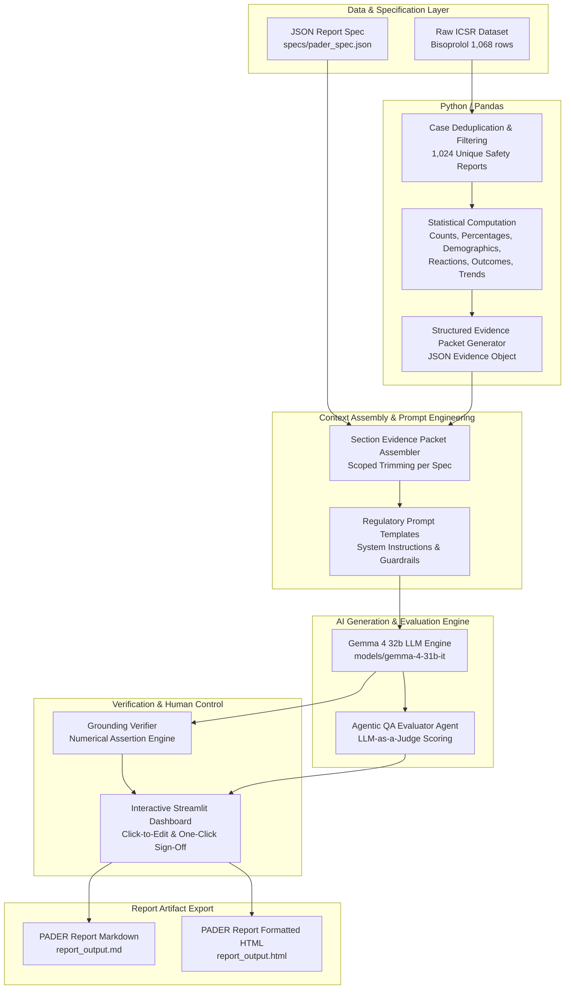

# GenAR AI Engineering Challenge: Enterprise Regulatory Safety Reporting Platform

An enterprise-grade, deterministic-first, LLM-narrated AI platform designed to transform raw Individual Case Safety Report (ICSR) datasets into structured, evidence-backed regulatory safety reports—including **Postmarketing Adverse Drug Experience Reports (PADER)**, **Periodic Safety Update Reports (PSUR / PBRER)**, and **Development Safety Update Reports (DSUR)**.

This platform executes **100% deterministic analytics** for all calculations, case deduplications, demographics, reaction rankings, and time-series trends using Python/Pandas, and leverages **Gemma 4 32b** (`models/gemma-4-31b-it`) via the Google Gemini API to author section-scoped regulatory narratives guarded by automated numerical assertion checks, an **Agentic QA Evaluator Agent (LLM-as-a-Judge)**, and an **Interactive Streamlit Human Control Sign-Off Dashboard**.

---

## 🎬 Demo Video & AI Voiceover Walkthrough

[](https://github.com/Rythamo8055/genar-ai-safety-reporting/raw/main/walkthrough_with_ai_voiceover.mp4)
[](https://quickhyre.streamlit.app/)

> **📹 [Click here to watch the full 1-Minute Live Demo Video with AI Voiceover Narration (`walkthrough_with_ai_voiceover.mp4`)](https://github.com/Rythamo8055/genar-ai-safety-reporting/blob/main/walkthrough_with_ai_voiceover.mp4)**

The demo video showcases the live Streamlit dashboard in action, scrolling through the ICSR datasets, deterministic Pandas calculations, Gemma 4 32b narrative generation, automated grounding verifier, and the interactive human-in-the-loop sign-off interface—all narrated with high-definition AI neural voiceover!

* **Direct Video Link:** [https://github.com/Rythamo8055/genar-ai-safety-reporting/raw/main/walkthrough_with_ai_voiceover.mp4](https://github.com/Rythamo8055/genar-ai-safety-reporting/raw/main/walkthrough_with_ai_voiceover.mp4)
* **Audio Track:** [https://github.com/Rythamo8055/genar-ai-safety-reporting/blob/main/narration.mp3](https://github.com/Rythamo8055/genar-ai-safety-reporting/blob/main/narration.mp3)

---

## 1. How Do I Run It?

### Prerequisites
- Python 3.9+
- Dependencies: `pandas`, `openpyxl`, `streamlit`, `pytest` (standard library modules: `json`, `urllib`, `re`, `unittest`)

### Setup & Execution Commands

```bash
# 1. Navigate to the project directory
cd "/home/rahul/development_walkins/challenge from company"

# 2. Set your API key environment variable
export GEMINI_API_KEY="YOUR_GEMINI_API_KEY"

# 3. Launch the Interactive Human Control & Review Web Dashboard (Streamlit)
streamlit run app.py

# 4. Run the primary CLI end-to-end PADER generation pipeline
python3 main.py

# 5. Run the Generic Specification Engine (demonstrating multi-report config generalization)
python3 src/spec_runner.py

# 6. Run the automated unit & integration test suite
python3 tests/test_pipeline.py
```

### Generated Deliverable Output Artifacts
Running `app.py`, `main.py`, or `src/spec_runner.py` produces:
* [`report_output.md`](file:///home/rahul/development_walkins/challenge%20from%20company/report_output.md) — The complete Markdown regulatory safety report.
* [`report_output.html`](file:///home/rahul/development_walkins/challenge%20from%20company/report_output.html) — The styled, standalone HTML regulatory safety report.

---

## 2. Architecture & Data Flow Overview



### Component Breakdown
* `app.py` — **Interactive Streamlit Web Dashboard** providing visual evidence side-by-side inspection, click-to-edit narrative prose editing, grounding audit status badges, and one-click regulatory sign-off & export.
* `src/analyzer.py` — Deterministic Pandas analytics engine. Deduplicates cases by `safetyreportid` (1,068 rows -> 1,024 unique cases), computes seriousness criteria, age bucketing, sex breakdown, country distributions, top MedDRA PT reactions, and monthly time-series trends.
* `src/context_builder.py` — Context engineering module. Formats section evidence packets so each LLM call receives only the minimal data required for that specific section.
* `specs/pader_spec.json` & `specs/psur_spec.json` — Report Specification Schemas defining report structure, required section metrics, and regulatory guidelines (21 CFR 314.80 for PADER, EMA GVP Module VII for PSUR).
* `src/spec_runner.py` — Generic Config-Driven Execution Engine that generates reports dynamically from any JSON report specification without code modifications.
* `prompts/prompts.py` — Regulatory system instructions and section prompt templates.
* `src/generator.py` — API runner targeting **Gemma 4 32b** (`models/gemma-4-31b-it`) with automatic fallback and exponential backoff retry handling.
* `src/verifier.py` — Automated grounding audit engine. Extracts all numbers/percentages from generated text and asserts exact match against dataset evidence.
* `src/evaluator_agent.py` — **Agentic QA Evaluator Agent (LLM-as-a-Judge)** evaluating sections on Grounding (1-5), Tone (1-5), Completeness (1-5), and Safety Speculation Guardrails (PASS/FAIL).
* `src/human_review.py` — Human Control & Review Gate managing section sign-off (APPROVED / FLAGGED / MODIFIED).
* `src/report_writer.py` — Compiles narratives, summary tables, case listings, and governance audit trails into `report_output.md` and `report_output.html`.

---

## 3. Why We Built It This Way (Design Rationale & Trade-off Analysis)

The table below details our explicit engineering decisions comparing alternative approaches against our chosen deterministic-first architecture:

| Design Dimension | Rejected Approach (Alternative) | Our Chosen Approach (This Platform) | Why We Only Do It This Way (Trade-off Rationale) |
|---|---|---|---|
| **Mathematical Computations** | Ask LLM to count/aggregate raw CSV rows | **100% Deterministic Python / Pandas** | LLMs are non-deterministic and hallucinate integer counts or percentages across 1,000+ rows. Regulatory submission requires zero-error mathematical precision. |
| **Context Retrieval** | Vector RAG / Chunk Embeddings over CSV | **Scoped Evidence Packet Assembly** | Vector RAG over tabular CSV risk retrieval omissions or losing global aggregates. Assembling structured JSON packets guarantees 100% data coverage without data dumping. |
| **Agentic Frameworks** | Heavy orchestration (LangChain / CrewAI / AutoGen) | **Light Native Python Modules** | Heavy frameworks add opaque abstraction layers, high latency, complex debugging, and brittleness. Clean native modules give total predictability and control. |
| **Multi-Report Scalability** | Hardcode report section logic in Python functions | **Config-Driven JSON Specifications (`specs/*.json`)** | Hardcoding section flows forces major code rewrites when adding PSUR, DSUR, or CSR reports. JSON specs separate report configuration from execution logic. |
| **Human Review & Sign-Off** | Programmatic CLI or text file review | **Interactive Streamlit Web Dashboard (`app.py`)** | Regulators and Safety Officers need visual side-by-side evidence inspection, click-to-edit prose adjustments, and instant download buttons. |

---

## 4. Where AI is Used vs. Deterministic Code

| Task / Calculation | Technology Used | Rationale & Justification |
|---|---|---|
| **Case Count & Deduplication** | Deterministic (Python/Pandas) | LLMs cannot reliably deduplicate IDs or sum integers across 1,000+ rows without hallucination risk. |
| **Demographics & Age Bucketing** | Deterministic (Python/Pandas) | Precise logic (<18, 18-64, 65+) requires 100% mathematical precision. |
| **Top Reaction PT Rankings** | Deterministic (Python/Pandas) | Group-by aggregations and frequency sorting are exact in Pandas. |
| **Expedited 15-Day Alert Totals** | Deterministic (Python/Pandas) | Regulatory threshold filtering (`fulfillexpeditecriteria == 'yes'`) must be mathematically verifiable. |
| **Regulatory Narrative Drafting** | AI (`Gemma 4 32b`) | LLMs excel at synthesizing quantitative data into formal, objective, regulatory prose. |
| **Grounding Audit Verification** | Deterministic (`regex` + Python) | Numerical assertion checking guarantees every figure in text maps back to raw evidence. |
| **QA Evaluation & Scoring** | AI (`RegulatoryEvaluatorAgent`) | LLM-as-a-Judge evaluates regulatory tone, section completeness, and safety speculation guardrails. |
| **Human Control Sign-Off** | Streamlit Dashboard (`app.py`) | Provides visual side-by-side click-to-edit prose editing and one-click approval sign-off. |

---

## 5. Prompts & Context Engineering Design

Each report section receives a minimal, isolated **Section Evidence Packet** rather than raw dataset dumps.

### System Instruction (`SYSTEM_INSTRUCTION`)
```text
You are an expert Regulatory Affairs Safety Specialist assisting in authoring a Postmarketing Adverse Drug Experience Report (PADER) for Bisoprolol.

STRICT REGULATORY COMPLIANCE RULES:
1. Grounding Rule: You MUST strictly summarize ONLY the exact figures, percentages, and metrics provided in the Section Evidence Packet. Do NOT invent, extrapolate, or hallucinate numbers or clinical facts.
2. Tone & Style: Maintain an objective, neutral, precise, and formal regulatory tone suitable for health authorities (FDA / EMA).
3. No Unsupported Safety Inferences: Do NOT declare a product "safe" or "unsafe" beyond what the quantitative evidence packet explicitly supports.
4. History of Actions Rule: If the dataset contains no reported actions, explicitly state that no safety-related actions were supplied for this reporting period.
5. Format: Output clean, well-formatted Markdown text without boilerplate introduction or wrapping code blocks.
6. Absolute Zero Scratchpad Rule: Write ONLY the final regulatory narrative paragraphs. Do NOT write any bullet points (*), scratchpad notes, drafting steps, or role-playing reflections.
```

---

## 6. Grounding & Evidence Traceability

How do we guarantee that every sentence in the report is backed by data?
1. **Zero Raw CSV Exposure:** The LLM never sees raw unaggregated CSV rows. It receives pre-verified quantitative packets.
2. **Automated Numerical Assertion Verifier (`src/verifier.py`):**
   - Parses generated narrative text using regex (`re.findall`) to extract all numeric quantities, percentages, and dates.
   - Asserts that every number belongs to the set of allowed evidence numbers computed by `ICSRAnalyzer`.
   - Computes a **Verification Rate (%)**. If ungrounded figures are detected, the section is flagged for review.
3. **Explicit Handling of Unprovided Data:** For fields not present in the dataset (such as History of Safety Actions), prompts explicitly instruct the LLM to state that no actions were supplied, preventing hallucinated safety histories.

---

## 7. How to Evaluate at Scale (1,000+ Generated Reports)

To evaluate this system across 1,000+ regulatory reports at production scale:
1. **Automated Assertion Suite (CI/CD):**
   - **Numerical Accuracy Rate:** 100% requirement that all numbers in text match deterministic evidence tables.
   - **Coverage Completeness Check:** Verifies every required section specified in the `ReportSpec` schema is present and non-empty.
2. **Agentic LLM-as-a-Judge Evaluation (`src/evaluator_agent.py`):**
   - Run an independent evaluation agent with a grading rubric evaluating:
     - *Factual Grounding Score (1-5)*
     - *Regulatory Tone Score (1-5)*
     - *Safety Speculation Violation Detection (PASS/FAIL)*
3. **Regression & Model Drift Testing:**
   - Execute benchmark dataset runs on every model update to catch formatting or reasoning drift.

---

## 8. Known Limitations & Future Enhancements

1. **Absence of System Organ Class (SOC) Mapping:**
   - *Limitation:* The dataset provides MedDRA Preferred Terms (PTs) but no SOC classification.
   - *Mitigation:* The system analyzes at the PT level and explicitly notes in Section 4 that higher-level SOC grouping was omitted due to dataset structure.
2. **Labeling / Expectedness Information:**
   - *Limitation:* No Company Core Data Sheet (CCDS) or approved package insert was provided to assess expectedness (labeled vs. unlabeled events).
   - *Mitigation:* Expectedness classification is treated as out of scope for Version 0 per `PADER_Starter_Guide.md`.
