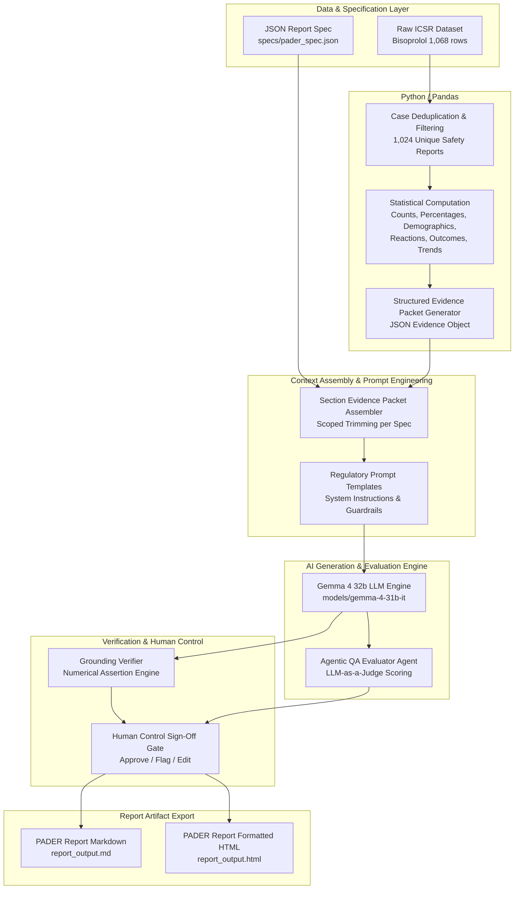

# Enterprise Regulatory Safety Report Platform — System Architecture

This document presents the industry-standard system architecture, component decomposition, data flow, context engineering, grounding mechanisms, and agentic governance gates for the **GenAR AI Engineering Challenge**.

---

## 1. System Architecture Diagram

---

## 2. Component & Data Flow Decomposition

### A. Raw Safety Data & Report Specs (`specs/pader_spec.json`, `Bisoprolol_icsr_sample_1068rows.xlsx`)
- **Dataset:** 1,068 individual ICSR rows representing postmarketing safety reports for Bisoprolol over a 1-year reporting period (Dec 27, 2024 to Dec 26, 2025).
- **Report Specification Schema (`specs/*.json`):** Defines the report structure, required section metrics, prompt keys, and regulatory framework (e.g. 21 CFR 314.80 for PADER, EMA GVP Module VII for PSUR).

### B. Deterministic Analytics Engine (`src/analyzer.py`)
- **Role:** Pure Python / Pandas analytics module. **Zero LLM involvement for calculations.**
- **Key Operations:**
  1. **Case Deduplication:** Deduplicates 1,068 line-item rows by `safetyreportid` to arrive at exactly 1,024 unique patient cases.
  2. **Demographics Bucketing:** Categorizes patient onset ages into standardized cohorts: *Pediatric (<18)*, *Adult (18-64)*, *Elderly (65+)*, and *Unknown*.
  3. **Reaction Ranking:** Counts unique cases per MedDRA Preferred Term (PT) reaction.
  4. **Expedited Alerts & Seriousness:** Computes 15-day alert totals (`fulfillexpeditecriteria == 'yes'`) and counts non-mutually exclusive seriousness criteria flags.
  5. **Time Series Distribution:** Aggregates monthly case reception volume across the reporting period.

### C. Context Assembly & Prompt Engineering (`src/context_builder.py`, `prompts/prompts.py`)
- **Role:** Implements strict context engineering.
- **Key Operations:**
  - Isolates data so that each LLM call receives **only** the specific numerical packet required for that section.
  - Eliminates "data dumping": The LLM is never given the raw 1,068-row CSV/Excel file or irrelevant section metrics.
  - Appends regulatory guardrails: Enforces objective tone, prohibits safety speculation beyond evidence, and requires explicit reporting of unprovided data (e.g., History of Actions).

### D. AI Narrative Engine (`src/generator.py`)
- **Model:** **Gemma 4 32b** (`models/gemma-4-31b-it`) via Google Gemini API (with automatic fallback to `gemini-3.6-flash`).
- **Role:** Translates pre-calculated quantitative metrics into formal regulatory narrative text.
- **Configuration:** Low temperature (0.1) for high factual reproducibility and retry handling for network stability.

### E. Grounding Verifier & Numerical Assertion (`src/verifier.py`)
- **Role:** Automated audit layer.
- **Key Operations:**
  - Parses generated section narratives using regex to extract all numerical figures, percentages, and dates.
  - Cross-references each number against the deterministic `allowed_numbers` set generated by `ICSRAnalyzer`.
  - Computes a **Grounding Verification Rate (%)** and flags any unverified numbers or potential hallucinations.

### F. Agentic Quality Evaluator Agent (`src/evaluator_agent.py`)
- **Role:** LLM-as-a-Judge auditor.
- **Key Operations:**
  - Evaluates each generated section on 4 independent metrics: *Factual Grounding Score (1-5)*, *Regulatory Tone Score (1-5)*, *Completeness Score (1-5)*, and *Safety Speculation Guardrail (PASS/FAIL)*.

### G. Human Control & Review Gate (`src/human_review.py`)
- **Role:** Implements human-in-the-loop review before report finalization.
- **Key Operations:**
  - Auto-flags sections with verification warnings or low grounding scores.
  - Allows regulatory experts to review, approve, flag, or manually edit section narratives.

### H. Report Formatting & Export (`src/report_writer.py`, `src/spec_runner.py`)
- **Role:** Compiles approved section narratives, structured summary tables, and a case index sample into final publishable artifacts (`report_output.md` and `report_output.html`).

---

## 3. Grounding & Safety Guarantees

| Challenge Requirement | How Our Architecture Guarantees It |
|---|---|
| **Zero Model Arithmetic** | All case counts, percentages, and rankings are calculated by Pandas prior to LLM invocation. |
| **No Hallucinated Safety Claims** | Prompts explicitly forbid inferring overall drug safety without supporting evidence. |
| **Traceability** | Every figure in the narrative maps directly back to an audited key in the deterministic evidence object. |
| **Handling Missing Data** | System explicitly reports "No action information provided" for missing dataset fields (e.g. History of Actions). |
