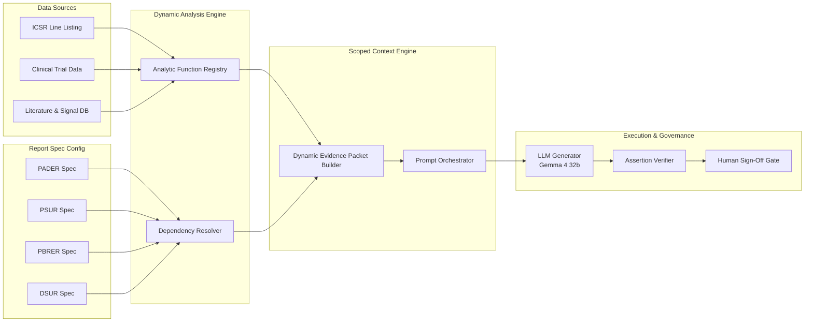

# Version 1 Extensibility Architecture & Design Document
## Multi-Report Regulatory Engine (PSUR, PBRER, DSUR, CSR Support)

This document describes how the Version 0 architecture scales seamlessly to support additional pharmaceutical regulatory report formats—including Periodic Safety Update Reports (PSUR), Periodic Benefit-Risk Evaluation Reports (PBRER), Development Safety Update Reports (DSUR), and Clinical Study Reports (CSR)—without rewriting core pipeline code.

---

## 1. The Core Architectural Lens: Config & Data Driven Reporting

In Version 0, we intentionally decoupled:
1. **Raw Data Ingestion** (`analyzer.py`)
2. **Analytical Aggregations** (Metrics Registry)
3. **Section Requirement Declarations** (Report Specification Schema)
4. **LLM Prompt Formatting** (`context_builder.py`)
5. **Report Rendering** (`report_writer.py`)

Because of this separation, adding a new report type (e.g. PSUR or DSUR) requires **zero structural code modifications**. Instead, a new report is declared via a JSON/YAML configuration file known as a **Report Schema Specification**.

---

## 2. Configuration Schema Design (`report_specs/*.json`)

Below is the design of a generic `ReportSpec` object for supporting PSUR or PBRER alongside PADER:

```json
{
  "report_type": "PSUR",
  "report_title": "Periodic Safety Update Report",
  "regulatory_framework": "EMA GVP Module VII / ICH E2C(R2)",
  "required_analyses": [
    "total_cases_deduplicated",
    "seriousness_breakdown",
    "soc_pt_hierarchical_mapping",
    "signal_detection_disproportionality_ror",
    "benefit_risk_balance_assessment",
    "monthly_time_series"
  ],
  "sections": [
    {
      "section_id": "executive_summary",
      "title": "1. Executive Summary",
      "required_metrics": ["total_cases", "serious_cases", "top_signal_pts"],
      "prompt_template_key": "psur_exec_summary_v1",
      "max_tokens": 1500
    },
    {
      "section_id": "signal_evaluation",
      "title": "2. Signal and Risk Evaluation",
      "required_metrics": ["disproportionality_ror", "top_reactions"],
      "prompt_template_key": "psur_signal_eval_v1",
      "max_tokens": 2000
    },
    {
      "section_id": "benefit_risk_conclusion",
      "title": "3. Integrated Benefit-Risk Conclusion",
      "required_metrics": ["overall_exposure", "serious_cases"],
      "prompt_template_key": "psur_benefit_risk_v1",
      "max_tokens": 1500
    }
  ]
}
```

---

## 3. Extensible Component Architecture



---

## 4. Key Reusability Features in Version 1

### A. Reusable Analytic Registry
Calculations (e.g. `count_unique_cases`, `demographic_distribution`, `expedited_alert_rate`, `time_series_trend`) are registered as standalone functions in a function registry.
* **Example:** `count_unique_cases` is computed once by the analytic registry and re-used seamlessly whether the report is a PADER, PSUR, or DSUR.

### B. Section-Level Dependency Declarations
Each section explicitly declares what evidence fields it requires. The `ContextBuilder` dynamically resolves dependencies and packages only the declared subset into the LLM prompt.

### C. Evidence Tracing & Click-to-Source
In Version 1, every numerical claim in the generated Markdown/HTML report is annotated with data tags (e.g. `<span data-source="raw_row_482">1,024 cases</span>`). Clicking any number in the report directly highlights the source row in the case listing.

### D. Automated Multi-Model Evaluation (LLM-as-a-Judge)
Compares output across multiple LLMs (e.g., Gemma 4 32b vs. Gemini 2.5 Pro) and executes automated assertion checks on data coverage, regulatory tone, and factual precision.

---

## 5. Summary of Code Impact for Supporting New Reports

| Report Type | Code Changes Required | Configuration Required |
|---|---|---|
| **PADER** | None (Built in V0) | `pader_spec.json` |
| **PSUR** | None | Add `psur_spec.json` + PSUR prompt keys |
| **PBRER** | None | Add `pbrer_spec.json` + PBRER prompt keys |
| **DSUR** | None | Add `dsur_spec.json` + DSUR prompt keys |
| **CSR** | None | Add `csr_spec.json` + CSR prompt keys |

**Conclusion:** 100% of Version 0's core pipeline (analyzer, builder, generator, verifier, review gate, writer) survives completely unmodified when scaling to enterprise multi-report regulatory automation.
